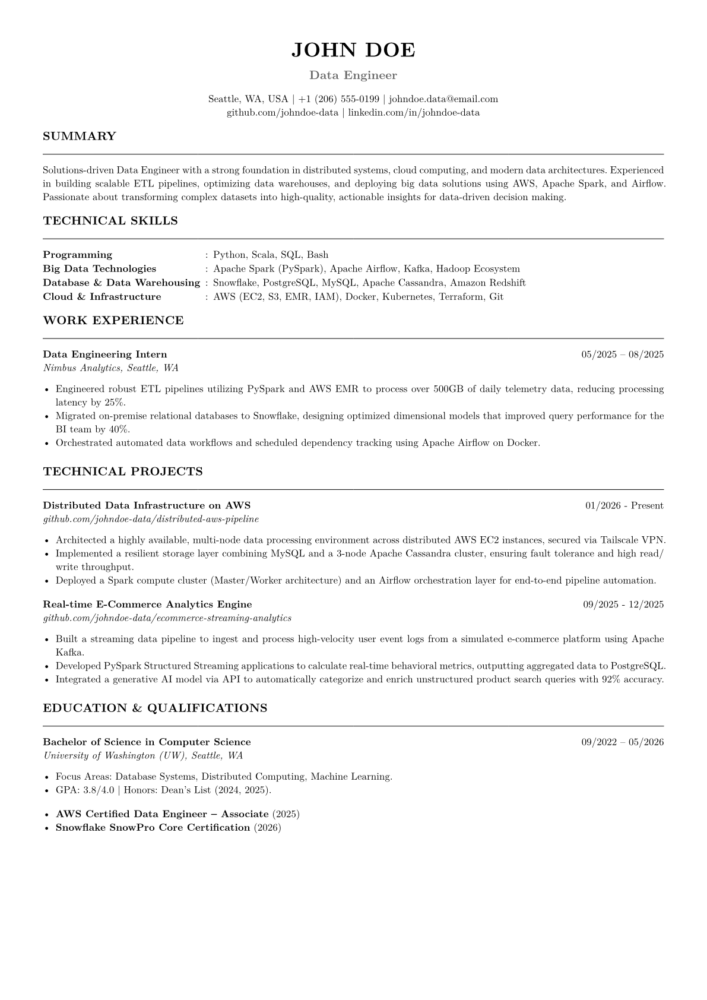

# LazyCV - Quick Start Guide

A minimalist, ATS-friendly CV template built with **Typst**.

## 1. Clone the Project
Open your terminal and run:
```bash
git clone https://github.com/hoangf384/lazycv.git
cd lazycv
```

## 2. Setup & Usage

### Option A: Using VS Code (Recommended)
This works with official **VS Code** or forks like **Cursor**, **VSCodium**, etc.

1. Open the folder in your editor: `code .`
2. If prompted to **"Reopen in Container"**, click it. (Requires Docker and the *Dev Containers* extension).
3. Once the container is ready, open `template.typ`.
4. The **Tinymist Typst** extension is pre-configured to show a live preview.

### Option B: Local Setup
If you prefer not to use Docker:
1. Install Typst from [typst.app](https://github.com/typst/typst).
2. Compile the PDF:
   ```bash
   typst compile template.typ
   ```
3. Watch for changes (auto-update PDF on save):
   ```bash
   typst watch template.typ
   ```

## 3. Examples




## 4. Build PDF

Using bash to compile CV (recommended)

```bash 
typst compile <name-of-cv-file>.typ --format=[pdf, png, html, svg]
```

## 5. Known Issues

- Hardcoded UID/GID: The image is currently locked to 1000:1000. Please change as needed.

- Extension Permissions: Some VS Code extensions (e.g., Tinymist) occasionally ignore the system umask and export PDFs with 600 permissions (private). Using the manual bash compile command above is the current workaround.


## 6. Agent-Native Autopilot (Autonomous Customization)

This repository is designed to be **agent-native**, meaning you can delegate the entire CV tailoring and cover letter drafting workflow to autonomous coding assistants (such as Claude Code, Gemini CLI, or Codex CLI).

* **System Entrypoint:** Read [AGENTS.md](file:///home/hp/projects/lazycv/runtime/AGENTS.md) for the harness specifications and environment rules.
* **System Architecture:** Read [ARCHITECTURE.md](file:///home/hp/projects/lazycv/runtime/ARCHITECTURE.md) to understand the interaction model, sequence diagrams, and state machine transitions.

### How it works:
1. **Contract-Guided Generation:** The CV Writer agent optimizes summaries and skill sets according to boundaries defined in `runtime/contracts/cv.md`, preventing any modifications to core candidate history.
2. **Procedural Workflows:** Playbooks in `runtime/playbooks/` instruct agents step-by-step on how to extract JDs, setup folders, and write drafts.
3. **Automated Quality Gate:** All generated CVs are programmatically verified using `tools/verify_cv.py` to ensure profile integrity before prompting for final user approval.