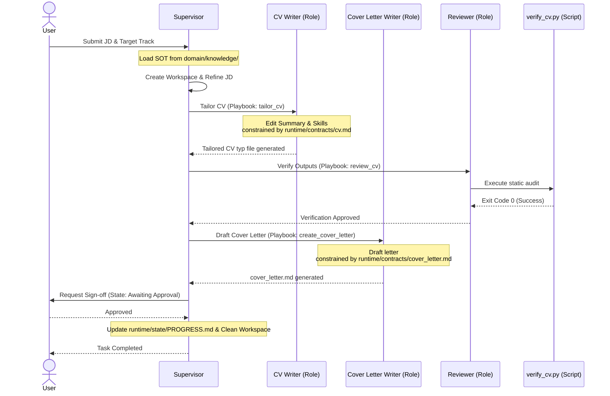
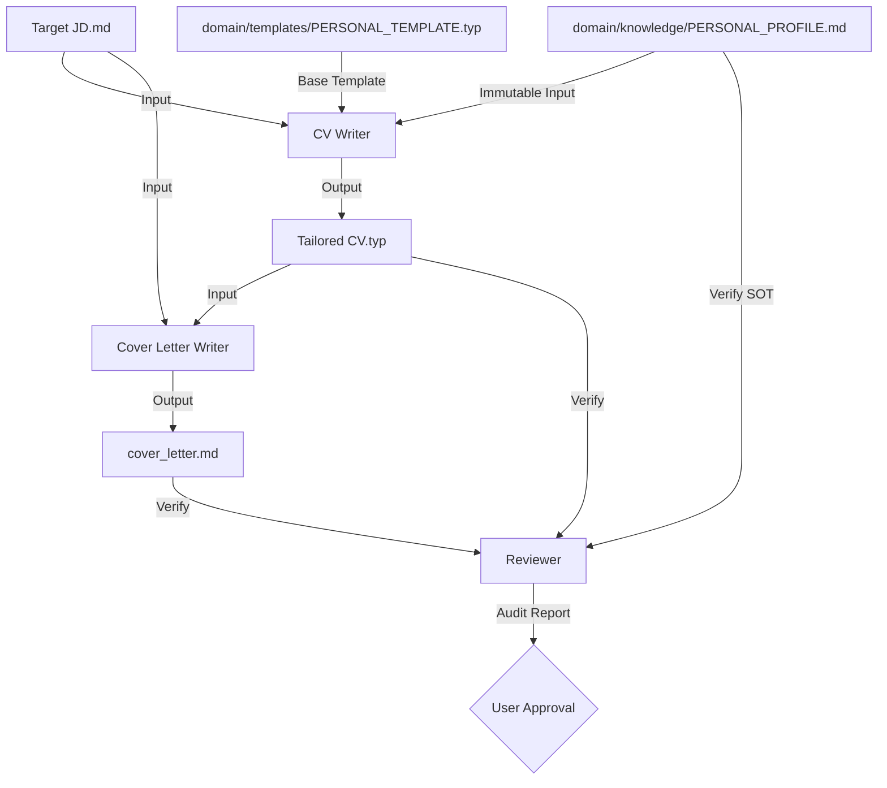
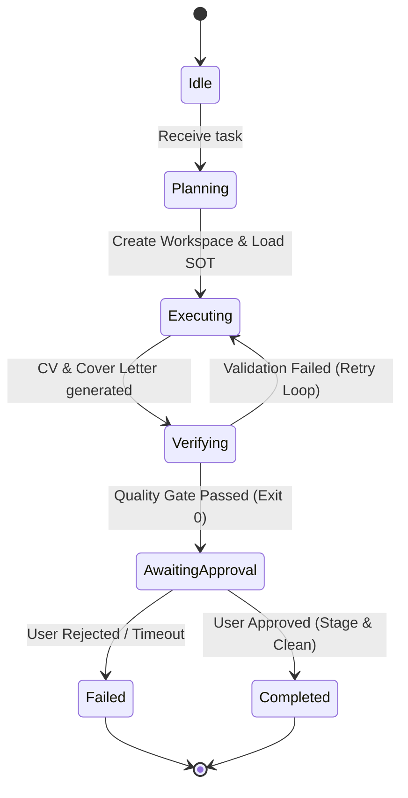

# Harness Interaction Architecture (ARCHITECTURE.md)

This document maps the interaction dynamics, data flows, and state transitions of the agent harness in the `lazycv` repository.

---

## 1. Execution Sequence

The sequence diagram below illustrates how the Supervisor orchestrates the workflow, loads contracts, delegates tasks to roles, runs programmatic verification, and requests user approval.

---

## 2. Data Flow Map

The diagram below details the data dependencies between input sources, processing roles, and intermediate output artifacts.

---

## 3. Harness State Machine

The Supervisor transitions the workspace through the following state machine. If an execution is interrupted, the recovery policy restores the last recorded state.

